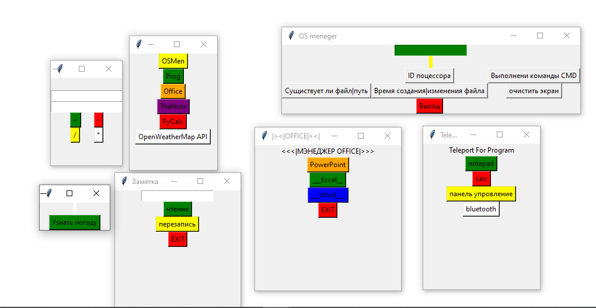

#Полезные утилиты

1,Запуск прог
2,инф. о системе
3,офис менеджер(пути на программы могут не совподать проверить в файле office.pyw)
3,Погода
4,заметка
5,python калкулятор
защита поролем его можно изменить в config.py файле
основной файл main.pyw